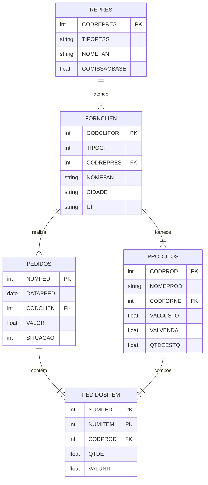

```mermaid
erDiagram
    REPRES ||--|{ FORNCLIEN : atende
    FORNCLIEN ||--|{ PRODUTOS : fornece
    FORNCLIEN ||--|{ PEDIDOS : realiza
    PEDIDOS ||--|{ PEDIDOSITEM : contem
    PRODUTOS ||--|{ PEDIDOSITEM : compoe

    REPRES {
        int CODREPRES PK
        string TIPOPESS
        string NOMEFAN
        float COMISSAOBASE
    }

    FORNCLIEN {
        int CODCLIFOR PK
        int TIPOCF
        int CODREPRES FK
        string NOMEFAN
        string CIDADE
        string UF
    }

    PRODUTOS {
        int CODPROD PK
        string NOMEPROD
        int CODFORNE FK
        float VALCUSTO
        float VALVENDA
        float QTDEESTQ
    }

    PEDIDOS {
        int NUMPED PK
        date DATAPPED
        int CODCLIEN FK
        float VALOR
        int SITUACAO
    }

    PEDIDOSITEM {
        int NUMPED PK
        int NUMITEM PK
        int CODPROD FK
        float QTDE
        float VALUNIT
    }
```
